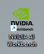
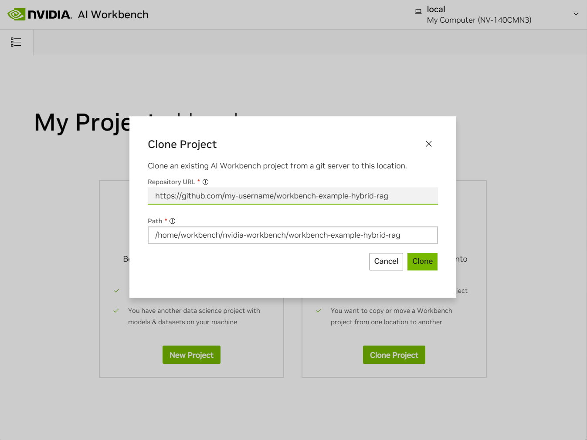
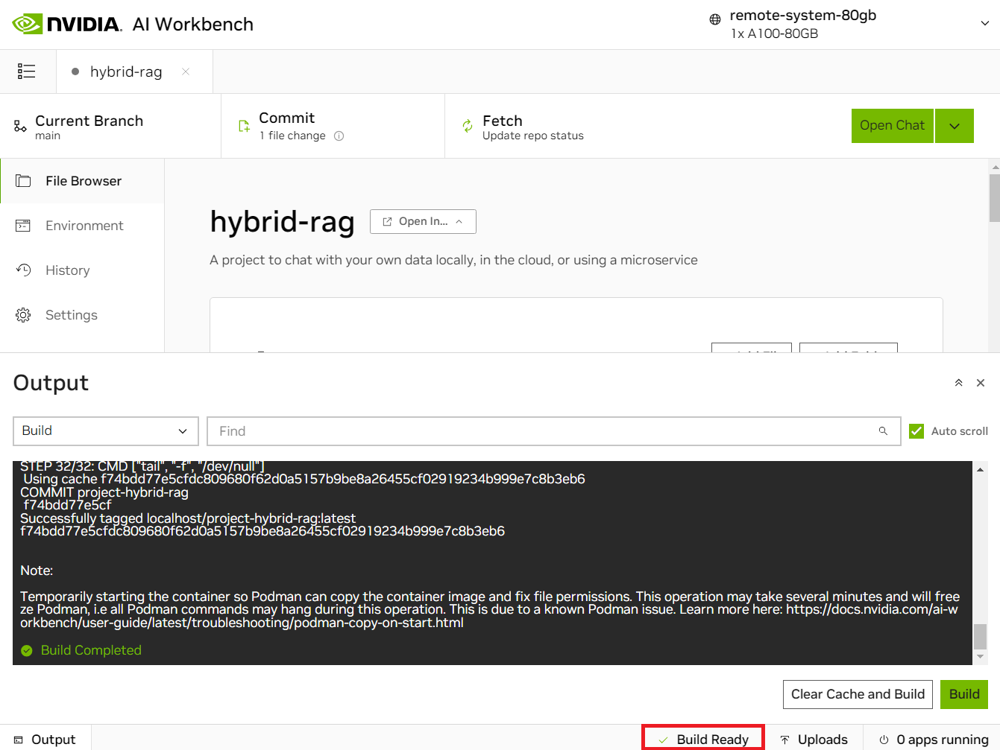
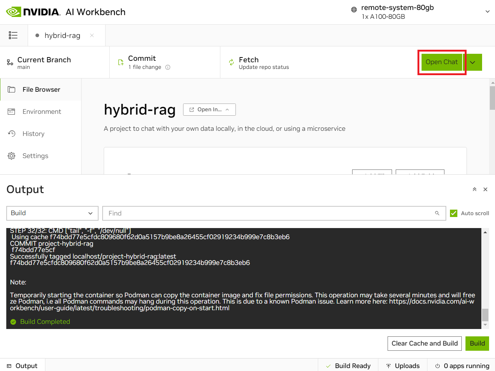
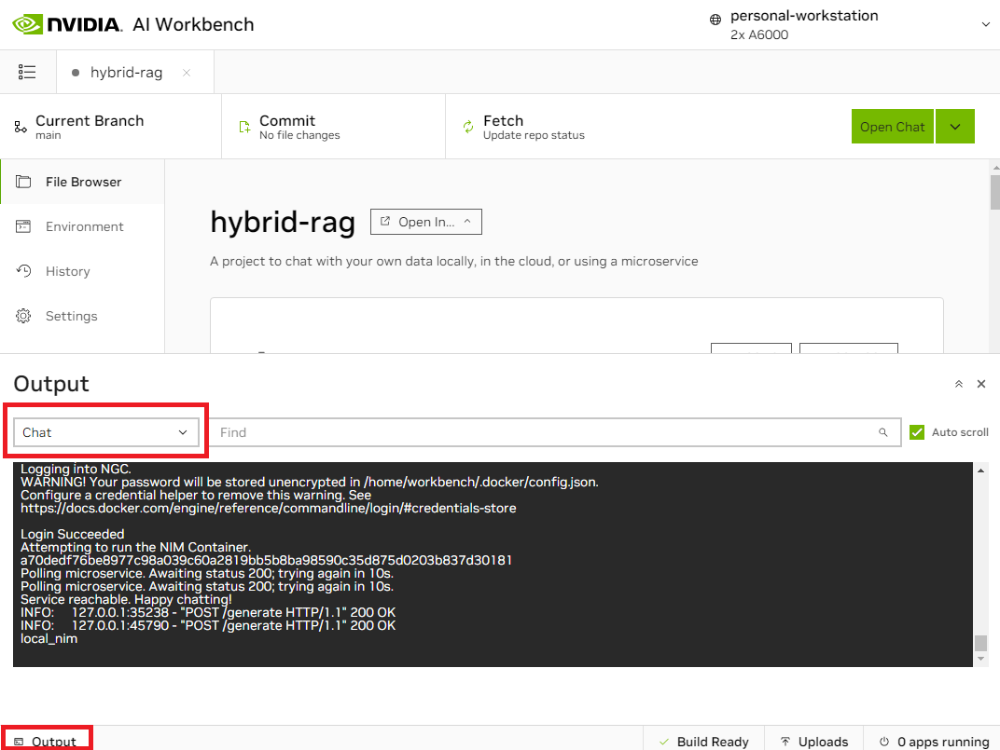
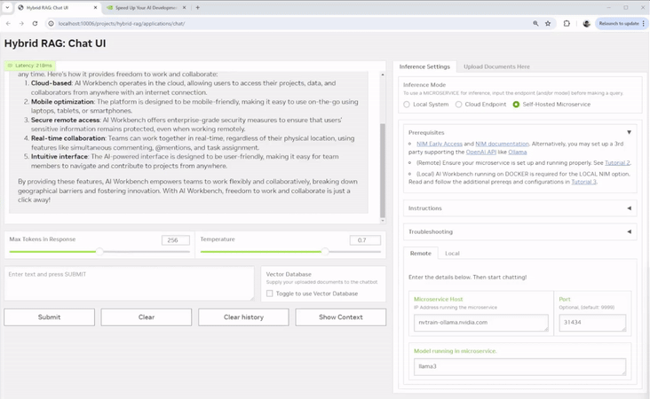
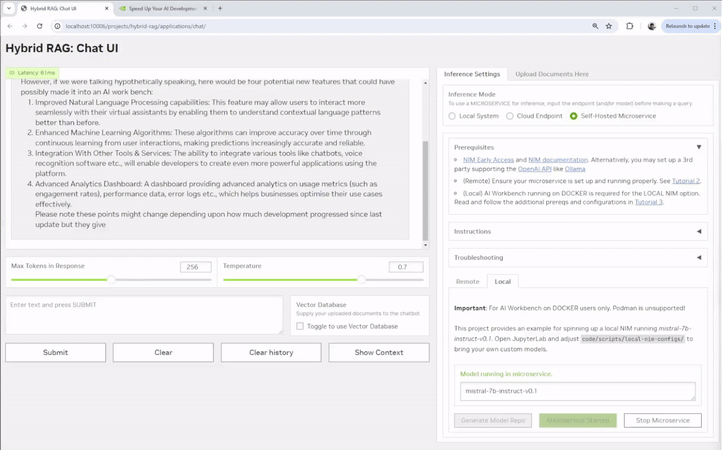

# An Easy Button for Retrieval Augmented Generation (RAG) 
This chat application works interchangeably with build.nvidia.com API endpoints, downloadable NVIDIA NIM containers, and Hugging Face TGI on NVIDIA GPUs. It makes testing RAG with NVIDIA endpoints, self-hosted NIMs, and third party models simple. 

<!-- Banner Image -->

> **Note**
> This app runs in [NVIDIA AI Workbench](https://docs.nvidia.com/ai-workbench/user-guide/latest/overview/introduction.html). It's a free, lightweight developer platform that you can run on your own systems to get up and running with complex AI applications and workloads in a short amount of time. 

> You may want to [**fork**](https://docs.github.com/en/pull-requests/collaborating-with-pull-requests/working-with-forks/fork-a-repo#forking-a-repository) this repository into your own account before proceeding. Otherwise you won't be able to fully push any changes you make because this NVIDIA-owned repository is **read-only**.

 

*Navigating the README*: [Project Overview](#project-overview) | [Quickstart](#quickstart) | [Troubleshooting](#troubleshooting) | [Advanced Tutorials](#advanced-tutorials) | [License](#license)

*Other Resources*: [:arrow_down: Download AI Workbench](https://www.nvidia.com/en-us/deep-learning-ai/solutions/data-science/workbench/) | [:book: User Guide](https://docs.nvidia.com/ai-workbench/) |[:open_file_folder: Other Projects](https://docs.nvidia.com/ai-workbench/user-guide/latest/quickstart/example-projects.html) | [:rotating_light: Support Thread](https://forums.developer.nvidia.com/t/support-workbench-example-project-hybrid-rag/288565)

## Project Overview
This is an [NVIDIA AI Workbench](https://www.nvidia.com/en-us/deep-learning-ai/solutions/data-science/workbench/) project for developing a [Retrieval Augmented Generation](https://blogs.nvidia.com/blog/what-is-retrieval-augmented-generation/) application with a customizable Gradio Chat app. It lets you:
* Embed your documents into a locally running vector database.
* Run inference **locally** on a Hugging Face TGI server, in the **cloud** using NVIDIA inference endpoints, or using **microservices** via [NIMs](https://www.nvidia.com/en-us/ai/):
    * 4-bit, 8-bit, and no quantization options are supported for locally running models served by TGI.
    * Other models may be specified to run locally using their Hugging Face tag.
    * Any downloadable NIM model can be used as a microservice, runnable via docker/podman compose in AI Workbench

### Table 1 Default Supported Models by Inference Mode

<b>Expand this section for a full table on all supported models by inference mode.</b>

 | Model    | Local ([TGI](https://huggingface.co/docs/text-generation-inference/en/index))         | Cloud ([NVIDIA API Catalog](https://build.nvidia.com/explore/discover)) | Microservices ([NVIDIA NIMs](https://www.nvidia.com/en-us/ai/)) |
 | -------- | ----------------------------- | --------------- | ------------------------------ |
 | Llama3-ChatQA-1.5-8B |           Y       |     Y           | *                              |
 | Llama3-ChatQA-1.5-70B |                  |     Y           | *                              |
 | Nemotron-Mini-4B |                       |     Y           | *                              |
 | Nemotron-4-340B-Instruct |               |     Y           | *                              |
 | Mistral-NeMo 12B Instruct |              |     Y           | *                              |
 | Mistral-7B-Instruct-v0.1 |    Y (gated)  |                 | *                              |
 | Mistral-7B-Instruct-v0.2 |    Y (gated)  |     Y           | *                              |
 | Mistral-7B-Instruct-v0.3 |               |     Y           | *                              |
 | Mixtral-8x7B-Instruct-v0.1 |             |     Y           | *                              |
 | Mixtral-8x22B-Instruct-v0.1 |            |     Y           | *                              |
 | Mamba Codestral 7B v0.1 |                |     Y           | *                              |
 | Llama-2-7B-Chat |             Y (gated)  |                 | *                              |
 | Llama-2-13B-Chat |                       |                 | *                              |
 | Llama-3-8B-Instruct |         Y (gated)  |     Y           | *                              |
 | Llama-3-70B-Instruct |                   |     Y           | *                              |
 | Llama-3.1-8B-Instruct |                  |     Y           | Y (default)                    |
 | Llama-3.1-70B-Instruct |                 |     Y           | *                              |
 | Llama-3.1-405B-Instruct |                |     Y           | *                              |
 | Gemma-2B |                               |     Y           | *                              |
 | Gemma-7B |                               |     Y           | *                              |
 | CodeGemma-7B |                           |     Y           | *                              |
 | Phi-3-Mini-4k-Instruct |                 |     Y           | *                              |
 | Phi-3-Mini-128k-Instruct |    Y          |     Y           | *                              |
 | Phi-3-Small-8k-Instruct |                |     Y           | *                              |
 | Phi-3-Small-128k-Instruct |              |     Y           | *                              |
 | Phi-3-Medium-4k-Instruct |               |     Y           | *                              |
 | Phi-3-Medium-128k-Instruct |             |     Y           | *                              |
 | Phi-3.5-Mini-Instruct |                  |     Y           | *                              |
 | Phi-3.5-MoE-Instruct |                   |     Y           | *                              |
 | Solar-10.7B-Instruct |                   |     Y           | *                              |
 | Jamba-1.5-Mini-Instruct |                |     Y           | *                              |
 | Jamba-1.5-Large-Instruct |               |     Y           | *                              |

*This project provides a sample flow for setting up the default ``meta/llama-3.1-8b-instruct`` NIM microservice running locally via docker/podman compose. More advanced users may choose to swap this NIM image out with other NIMs as they are released. 

# Quickstart
This section demonstrates how to use this project to run RAG via **NVIDIA Inference Endpoints** hosted on the [NVIDIA API Catalog](https://build.nvidia.com/explore/discover). For other inference options, including local inference, see the [Advanced Tutorials](#advanced-tutorials) section for set up and instructions.

## Prerequisites
- An [NGC account](https://ngc.nvidia.com/signin) is required to generate an NVIDIA API Key. 
- A valid NVIDIA API Key is required to access NVIDIA API endpoints. Generate a key on any NVIDIA API catalog model card, eg. [here](https://build.nvidia.com/meta/llama-3_1-8b-instruct) by clicking **Get API Key**. 

## Tutorial: Using a Cloud Endpoint

1. [Install](https://docs.nvidia.com/ai-workbench/user-guide/latest/installation/overview.html) NVIDIA AI Workbench. Open AI Workbench and select a location of your choice. 
2. (Optional) Fork this repo into *your own* GitHub account. 
3. **Inside AI Workbench**:
    - Click **Clone Project** and enter the repo URL of your desired repository.
    - AI Workbench will automatically clone the repo and build out the environment, which can take several minutes.
    - On the **Project Dashboard**, resolve the yellow unconfigured secrets warning by inputting your ``NVIDIA_API_KEY``
    - Select **Open Chat** on the top right of the AI Workbench window, and the Gradio app will open in a browser. 
4. **In the Gradio Chat app**:
    - Click **Set up RAG Backend**. This triggers a one-time backend build which can take a few moments to initialize.
    - Select the **Cloud** option, select a model family and model name, and submit a query. 
    - To perform RAG, select **Upload Documents Here** from the right hand panel of the chat UI.
         - You may see a warning that the vector database is not ready yet. If so wait a moment and try again. 
    - When the database starts, select **Click to Upload** and choose the text files to upload.
    - Once the files upload, the **Toggle to Use Vector Database** next to the text input box will turn on.
    - Now query your documents! What are they telling you?
    - To change the endpoint, choose a different model from the right-hand dropdown settings and continue querying.

---
**Next Steps:**
* If you get stuck, check out the [Troubleshooting](#troubleshooting) section.
* For tutorials on other supported inference modes, check out the ["Advanced Tutorials"](#advanced-tutorials) section below. **Note:** All subsequent tutorials will assume ``NVIDIA_API_KEY`` is already configured with your credentials. 

---

# Troubleshooting

Need help? Submit any questions, bugs, feature requests, and feedback at the Developer Forum for AI Workbench. The dedicated thread for this Hybrid RAG example project is located [here](https://forums.developer.nvidia.com/t/support-workbench-example-project-hybrid-rag/288565). 

<b>How do I open AI Workbench?</b>

- Make sure you [installed](https://docs.nvidia.com/ai-workbench/user-guide/latest/installation/overview.html) AI Workbench. There should be a desktop icon on your system. Double click it to start AI Workbench.

    

<b>How do I clone this repo with AI Workbench?</b>

- Make sure you have opened AI Workbench.
- Click on the **Local** location (or whatever location you want to clone into).
- If this is your first project, click the green **Clone Existing Project** button.
    - Otherwise, click **Clone Project** in the top right
- Drop in the repo URL, leave the default path, and click **Clone**. 

    

<b>I've cloned the project, but now nothing seems to be happening?</b>

- The container is likely building and can take several minutes.
- Look at the very *bottom* of the Workbench window, you will see a **Build Status** widget.
- Click it to expand the build output. 
- When the container is built, the widget will say `Build Ready`.
- Now you can begin. 

    

<b>How do I start the Chat application?</b>

- Check that the container finished building.
- When it finishes, click the green **Open Chat** button at the top right.

    

<b>Something went wrong, how do I debug the Chat application?</b>

- Look at the bottom left of the AI Workbench window, you will see an **Output** widget.
- Click it to expand the output. 
- Expand the dropdown, navigate to ``Applications`` > ``Chat``.
- You can now view all debug messages in the Output window in real time.

    

<b>How can I customize this project with AI Workbench?</b>

- Check that the container is built.
- Then click the green **dropdown** next to the `Open Chat` button at the top right.
- Select **JupyterLab** to start editing the code. Alternatively, you may configure VSCode support [here](https://docs.nvidia.com/ai-workbench/user-guide/latest/reference/applications/built-in/vs-code.html).

    

# Advanced Tutorials
This section shows you how to use different inference modes with this hybrid RAG project. 

 | Inference Mode                              | Minimum Recommended GPU (VRAM)  |
 |---------------------------------------------|---------------------------------|
 | Tutorial 1: Using a local GPU               | 12 GB                           |
 | Tutorial 2: Using a Remote NIM microservice | 0 GB; 24 GB on a remote system  |
 | Tutorial 3: Using a Local NIM Microservice  | 24 GB                           |

If you have insufficient hardware, go back to the [Quickstart Tutorial](#tutorial-using-a-cloud-endpoint), which demonstrates how to use **Cloud Endpoints** for RAG. 

<b>Expand for Tutorial 1: Using a local GPU</b>

  This tutorial assumes you already cloned this Hybrid RAG project to your AI Workbench. If not, please follow the beginning of the [Quickstart Tutorial](#tutorial-using-a-cloud-endpoint). 

#### Additional Configurations

##### Ungated Models
The following models are _ungated_. These can be accessed, downloaded, and run locally inside the project with no additional configurations required:
  * [nvidia/Llama3-ChatQA-1.5-8B](https://huggingface.co/nvidia/Llama3-ChatQA-1.5-8B)
  * [microsoft/Phi-3-mini-128k-instruct](https://huggingface.co/microsoft/Phi-3-mini-128k-instruct)

##### Gated models
Some additional configurations in AI Workbench are required to run certain listed models. Unlike the previous tutorials, these configs are not added to the project by default, so please follow the following instructions closely to ensure a proper setup. Namely, a Hugging Face API token is required for running gated models locally. [See how to create a token here](https://huggingface.co/docs/hub/en/security-tokens).

The following models are _gated_. Verify that ``You have been granted access to this model`` appears on the model cards for any models you are interested in running locally:
  * [Mistral-7B-Instruct-v0.1](https://huggingface.co/mistralai/Mistral-7B-Instruct-v0.1)
  * [Mistral-7B-Instruct-v0.2](https://huggingface.co/mistralai/Mistral-7B-Instruct-v0.2)
  * [Llama-2-7b-chat-hf](https://huggingface.co/meta-llama/Llama-2-7b-chat-hf)
  * [Llama-3-8B-Instruct](https://huggingface.co/meta-llama/Meta-Llama-3-8B-Instruct)

Then, complete the following steps: 
1. If the project is already running, shut down the project environment under **Project Dashboard** > **Stop Container**. This will ensure restarting the environment will incorporate all the below configurations. 
2. In AI Workbench, add the following entries under **Environment** > **Project Container** > **Variables**. 
   * <ins>Your Hugging Face Token</ins>: This is used to clone the model weights locally from Hugging Face.
       * _Name_: ``HUGGING_FACE_HUB_TOKEN``
       * _Value_: (Your HF API Key)
       * _Description_: HF Token for cloning model weights locally
       * Mark this variable as **Sensitive** before adding to your project
3. **Rebuild** the project if needed to incorporate changes.

**Note:** All subsequent tutorials will assume both ``NVIDIA_API_KEY`` and ``HUGGING_FACE_HUB_TOKEN`` are already configured with your credentials. 

### Inference

1. Select the green **Open Chat** button on the top right the AI Workbench project window. 
2. Once the UI opens, click **Set up RAG Backend**. This triggers a one-time backend build which can take a few moments to initialize.
3. Select the **Local System** inference mode under ``Inference Settings`` > ``Inference Mode``. 
4. Select a model from the dropdown on the right hand settings panel. You can filter by gated vs ungated models for convenience. 
    * Ensure you have proper access permissions for the model; instructions are [here](https://github.com/NVIDIA/workbench-example-hybrid-rag?tab=readme-ov-file#additional-configurations).
    * You can also input a custom model from Hugging Face, following the same format. Careful, as not all models and quantization levels may be supported in the current TGI version!
5. Select a quantization level. The recommended precision for your system will be pre-selected for you, but full, 8-bit, and 4-bit bitsandbytes precision levels are currently supported. 

###### Table 2 System Resources vs Model Size and Quantization

 | vRAM    | System RAM | Disk Storage | Recommended Model Size & Quantization |
 |---------|------------|--------------|---------------------------|
 | >=12 GB | 32 GB      | 40 GB        | 7B & int4                 |
 | >=24 GB | 64 GB      | 40 GB        | 7B & int8                 |
 | >=40 GB | 64 GB      | 40 GB        | 7B & none                 |

6. Select **Load Model** to pre-fetch the model. This will take up to several minutes to perform an initial download of the model to the project cache. Subsequent loads will detect this cached model. 
7. Select **Start Server** to start the inference server with your current local GPU. This may take a moment to warm up.
8. Now, start chatting! Queries will be made to the model running on your local system whenever this inference mode is selected.

### Using RAG

9. In the right hand panel of the Chat UI select **Upload Documents Here**. Click to upload or drag and drop the desired text files to upload.
   * You may see a warning that the vector database is not ready yet. If so wait a moment and try again. 
10. Once the files upload, the **Toggle to Use Vector Database** next to the text input box will turn on by default.
11. Now query your documents! To use a different model, stop the server, make your selections, and restart the inference server.

<b>Expand for Tutorial 2: Using a Remote NIM microservice</b>

This tutorial assumes you already cloned this Hybrid RAG project to your AI Workbench. If not, please follow the beginning of the [Quickstart Tutorial](#tutorial-using-a-cloud-endpoint). 

#### Additional Configurations

* You must have access to NVIDIA NIM. Sign up for free today with the [NVIDIA Developer Program](https://developer.nvidia.com/developer-program)! 
* Set up your NVIDIA Inference Microservice (NIM) to run self-hosted on another system of your choice. The playbook to get started is located [here](https://docs.nvidia.com/nim/large-language-models/latest/getting-started.html). Remember the _model name_ (if not the ``meta/llama-3.1-8b-instruct`` default) and the _ip address_ of this remotely running microservice. Ports for NIMs are generally set to 8000 by default.
* **Alternatively**, you may set up any other 3rd party supporting the OpenAI API Specification. One example is [Ollama](https://github.com/ollama/ollama/blob/main/README.md#building), as they support the [OpenAI API Spec](https://github.com/ollama/ollama/blob/main/docs/openai.md). Remember the _model name_, _port_, and the _ip address_ when you set this up. 

### Inference

1. Select the green **Open Chat** button on the top right the AI Workbench project window. 
2. Once the UI opens, click **Set up RAG Backend**. This triggers a one-time backend build which can take a few moments to initialize.
3. Select the **Self-hosted Microservice** inference mode under ``Inference Settings`` > ``Inference Mode``. 
4. Input the remote **IP address** of the accessible system running the microservice, **Port** if different from the 8000 default for NIMs, as well as the **model name** to run if different from the ``meta/llama3-8b-instruct`` default. 
5. Now start chatting! Queries will be made to the microservice running on a remote system whenever this inference mode is selected.

### Using RAG

6. In the right hand panel of the Chat UI select **Upload Documents Here**. Click to upload or drag and drop the desired text files to upload. 
   * You may see a warning that the vector database is not ready yet. If so wait a moment and try again. 
7. Once uploaded successfully, the **Toggle to Use Vector Database** should turn on by default next to your text input box.
8. Now you may query your documents!

<b>Expand for Tutorial 3: Using a Local NIM Microservice</b>

This tutorial assumes you already cloned this Hybrid RAG project to your AI Workbench. If not, please follow the beginning of the [Quickstart Tutorial](#tutorial-using-a-cloud-endpoint). 

#### Additional Configurations
* You must have access to NVIDIA NIM. Sign up for free today with the [NVIDIA Developer Program](https://developer.nvidia.com/developer-program)! 
* Shut down any other processes running locally on the GPU as these may result in memory issues when running the microservice locally. 

### Inference
1. On the main **Project Dashboard**, select **Start** under the Compose section to spin up a sample ``llama-3.1-8b-instruct`` NIM container.
     a. Wait for this container to be ready for inference. This can take a few minutes.
     b. You can monitor progress via the compose logs by selecting **Output** on the bottom left corner and **Compose** from the dropdown.
     c. Readiness is typically indicated by a message similar to: ``Uvicorn running on http://0.0.0.0:8000 (Press CTRL+C to quit)``
2. Select the green **Open Chat** button on the top right the AI Workbench project window.
3. Once the UI opens, click **Set up RAG Backend**. This triggers a one-time backend build which can take a few moments to initialize.
4. Select the **Self-hosted Microservice** inference mode under ``Inference Settings`` > ``Inference Mode``. 
5. Adjust the **Microservice Host**, **Port**, and/or **Model Name** depending on your deployment. For the default flow you may leave this as-is. 
6. Now, you can start chatting! Queries will be made to your microservice running on the local system whenever this inference mode is selected.

### Using RAG

8. In the right hand panel of the Chat UI select **Upload Documents Here**. Click to upload or drag and drop the desired text files to upload. 
   * You may see a warning that the vector database is not ready yet. If so wait a moment and try again. 
9. Once uploaded successfully, the **Toggle to Use Vector Database** should turn on by default next to your text input box.
10. Now you may query your documents!

<b>Expand for Tutorial 4: Customizing the Gradio App</b>

By default, you may customize Gradio app using the jupyterlab container application. Alternatively, you may configure VSCode support [here](https://docs.nvidia.com/ai-workbench/user-guide/latest/reference/applications/built-in/vs-code.html).

1. In AI Workbench, navigate to **Environment** > **Project Container** > **Apps** and select **Open JupyterLab**.
2. Go into the `code/chatui/` folder and start editing the files.
3. Save the files.
4. To see your changes, stop the Chat UI if running and restart it.
5. To version your changes, commit them in the Workbench project window and push to your GitHub repo.

In addition to modifying the Gradio frontend, you can also use the Jupyterlab or another IDE to customize other aspects of the project, eg. custom chains, backend server, scripts, configs, etc.

# License
This NVIDIA AI Workbench example project is under the [Apache 2.0 License](https://github.com/NVIDIA/workbench-example-hybrid-rag/blob/main/LICENSE.txt)

This project may download and install additional third-party open source software projects. Review the license terms of these open source projects before use. Third party components used as part of this project are subject to their separate legal notices or terms that accompany the components. You are responsible for confirming compliance with third-party component license terms and requirements. 
