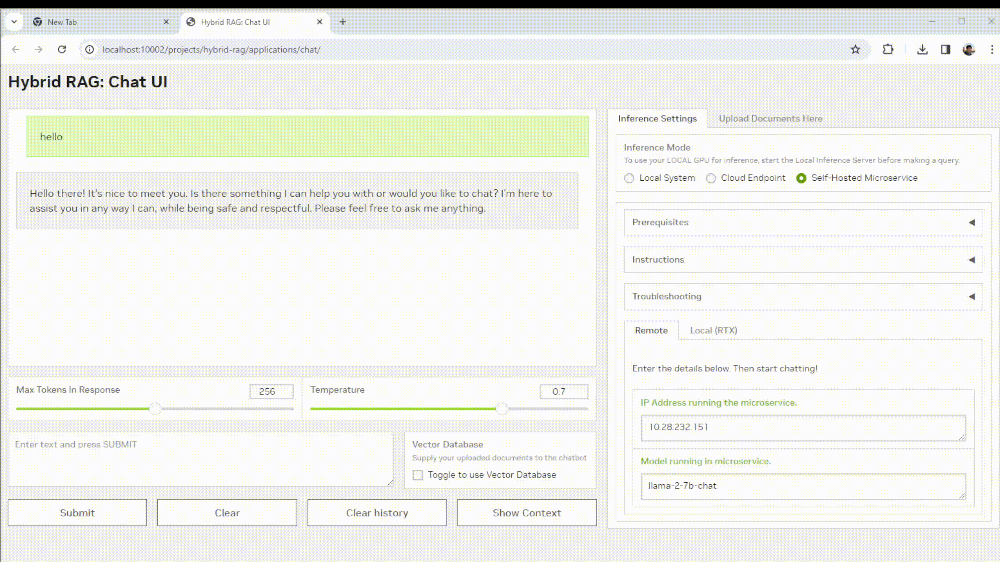

# A Hybrid RAG Project on AI Workbench
This is an [NVIDIA AI Workbench](https://www.nvidia.com/en-us/deep-learning-ai/solutions/data-science/workbench/) project for developing a [Retrieval Augmented Generation](https://blogs.nvidia.com/blog/what-is-retrieval-augmented-generation/) application with a customizable Gradio Chat app. It lets you:
* Embed your documents into a locally running vector database.
* Run inference **locally** on a Hugging Face TGI server, in the **cloud** using NVIDIA inference endpoints, or using **microservices** via [NVIDIA Inference Microservices (NIMs)](https://www.nvidia.com/en-us/ai/):
    * 4-bit, 8-bit, and no quantization options are supported for locally running models served by TGI.
    * Other models may be specified to run locally using their Hugging Face tag.
    * Locally-running microservice option is supported for Docker users only.

### Table 1 Default Supported Models by Inference Mode

 | Model    | Local Inference (TGI) | Cloud Endpoints | Microservices (Local, Remote)  |
 | -------- | --------------------- | --------------- | ------------------------------ |
 | Mistral-7B-Instruct-v0.1 |    Y  |                 | Y *                            |
 | Mistral-7B-Instruct-v0.2 |    Y  |     Y           | *                              |
 | Mistral-Large |                  |     Y           | *                              |
 | Mixtral-8x7B-Instruct-v0.1 |     |     Y           | *                              |
 | Mixtral-8x22B-Instruct-v0.1 |    |     Y           | *                              |
 | Llama-2-7B-Chat |             Y  |                 | *                              |
 | Llama-2-13B-Chat |               |                 | *                              |
 | Llama-2-70B-Chat |               |     Y           | *                              |
 | Llama-3-8B-Instruct |         Y  |     Y           | *                              |
 | Llama-3-70B-Instruct |           |     Y           | *                              |
 | Gemma-2B |                       |     Y           | *                              |
 | Gemma-7B |                       |     Y           | *                              |
 | CodeGemma-7B |                   |     Y           | *                              |
 | Phi-3-Mini-128k-Instruct |       |     Y           | *                              |
 | Arctic |                          |     Y           | *                              |

*NIMs are currently in Early Access. If you set up any accessible language model NIM running on another system, it supported for Remote NIM inference in this project. For Local NIM inference, this project provides a flow for setting up the ``mistral-7b-instruct-v0.1`` locally as an example. For advanced users, the model can be swapped out by editing the code base using additional instructions provided [here](https://github.com/NVIDIA/workbench-example-hybrid-rag/blob/main/code/scripts/local-nim-configs/README.md). 

# Quickstart
This section demonstrates how to use this project to run RAG using inference via NVIDIA cloud endpoints. 

### Prerequisites
- An [NGC account](https://ngc.nvidia.com/signin) is required to generate an NVCF run key. 
- A valid NVCF key is required to access NVIDIA API endpoints. Generate a key on any API catalog model card, eg. [here](https://build.nvidia.com/mistralai/mistral-7b-instruct-v2) by clicking "Get API Key". 
- A Hugging Face API token is recommended for running models **locally**. Ensure you have the right permissions in your account to access the models. [See how to create one here](https://huggingface.co/docs/hub/en/security-tokens).
    - Check that "You have been granted access to this model" appears on any models you are interested in running locally:
        - [Mistral-7B-Instruct-v0.1](https://huggingface.co/mistralai/Mistral-7B-Instruct-v0.1)
        - [Mistral-7B-Instruct-v0.2](https://huggingface.co/mistralai/Mistral-7B-Instruct-v0.2)
        - [Llama-2-7b-chat-hf](https://huggingface.co/meta-llama/Llama-2-7b-chat-hf)
        - [Llama-3-8B-Instruct](https://huggingface.co/meta-llama/Meta-Llama-3-8B-Instruct)

### Tutorial: Using a Cloud Endpoint

1. [Install and configure](#nvidia-ai-workbench) AI Workbench locally and open up AI Workbench. Select a location of your choice. 
2. Fork this repo into *your own* GitHub account.
3. **Inside AI Workbench**:
    - Click **Clone Project** and enter the repo URL of your newly-forked repo.
    - AI Workbench will automatically clone the repo and build out the project environment, which can take several minutes to complete. 
    - Upon `Build Complete`, select **Open Chat** by clicking the green button at the top right. 
    - When prompted, enter your **Hugging Face token** and **NVIDIA NVCF run key** as project secrets.
        - There is a known issue for build 0.44.8 where the secret(s) may truncate when pasted. Alternatively, configure the secret by ``Environment`` > ``Secrets`` > ``<secret_name>`` > ``Configure``. 
    - Select **Open Chat**, and the Gradio app will open in a browser. This takes around 30 seconds.
4. **In the Gradio Chat app**:
    - Click **Set up RAG Backend**. This triggers a one-time backend build which can take a few moments to initialize.
    - Select the **Cloud** option, select a model family and model name, and submit a query. 
    - To perform RAG, select **Upload Documents Here** from the right hand panel of the chat UI.
         - You may see a warning that the vector database is not ready yet. If so wait a moment and try again. 
    - When the database starts, select **Click to Upload** and choose the text files to upload.
    - Once the files upload, the **Toggle to Use Vector Database** next to the text input box will turn on.
    - Now query your documents! What are they telling you?
    - To change the endpoint, select a different model from the right-hand dropdown and continue querying.

---
**Next Steps:**
* If you get stuck, check out the ["Troubleshooting"](#troubleshooting) section.
* For tutorials on other supported inference modes, check out the ["Advanced Tutorials"](#advanced-tutorials) section below. 

---

### NVIDIA AI Workbench
**Note:** [NVIDIA AI Workbench](https://www.youtube.com/watch?v=ntMRzPzSvM4) is the easiest way to get this RAG app running.
- NVIDIA AI Workbench is a <ins>free client application</ins> that you can install on your own machines.
- It provides portable and reproducible dev environments by handling Git repos and containers for you.
- Installing on a local system? Check out our guides here for [Windows](https://docs.nvidia.com/ai-workbench/user-guide/latest/installation/windows.html), [Local Ubuntu 22.04](https://docs.nvidia.com/ai-workbench/user-guide/latest/installation/ubuntu-local.html) and for [macOS 12 or higher](https://docs.nvidia.com/ai-workbench/user-guide/latest/installation/macos.html)
- Installing on a remote system? Check out our guide for [Remote Ubuntu 22.04](https://docs.nvidia.com/ai-workbench/user-guide/latest/installation/ubuntu-remote.html)

## Troubleshooting

Need help? Submit any questions, bugs, feature requests, and feedback at the Developer Forum for AI Workbench. The dedicated thread for this Hybrid RAG example project is located [here](https://forums.developer.nvidia.com/t/support-workbench-example-project-hybrid-rag/288565). 

### How do I open AI Workbench?
- Make sure you [installed](#nvidia-ai-workbench) AI Workbench. There should be a desktop icon on your system. Double click it to start AI Workbench.

    

### How do I clone this repo with AI Workbench?
- Make sure you have opened AI Workbench.
- Click on the **Local** location (or whatever location you want to clone into).
- If this is your first project, click the green **Clone Existing Project** button.
    - Otherwise, click **Clone Project** in the top right
- Drop in the repo URL, leave the default path, and click **Clone**. 

    

### I've cloned the project, but now nothing seems to be happening?
- The container is building and can take several minutes.
- Look at the very <ins>bottom</ins> of the Workbench window, you will see a **Build Status** widget.
- Click it to expand the build output. 
- When the container is built, the widget will say `Build Ready`.
- Now you can begin. 

    

### How do I start the Chat application?
- Check that the container finished building.
- When it finishes, click the green **Open Chat** button at the top right.

    

### How can I customize this project with AI Workbench?
- Check that the container is built.
- Then click the green **dropdown** next to the `Open Chat` button at the top right.
- Select **JupyterLab** to start editing the code. Alternatively, you may configure VSCode support [here](https://docs.nvidia.com/ai-workbench/user-guide/latest/reference/applications/built-in/vs-code.html).

    

# Advanced Tutorials
This section shows you how to use difference inference modes with this RAG project. For these tutorials, a GPU of at least 12 GB of vRAM is recommended. If you don't have one, go back to the [Quickstart Tutorial](#tutorial-using-a-cloud-endpoint) that shows how to use **Cloud Endpoints**. 

## Tutorial 1: Using a local GPU
This tutorial assumes you already cloned this Hybrid RAG project to your AI Workbench. If not, please follow the beginning of the [Quickstart Tutorial](#tutorial-using-a-cloud-endpoint). 

**Inference**

1. Select the green **Open Chat** button on the top right the AI Workbench project window. 
    * You may be prompted to enter your NVCF and Hugging Face keys as project secrets. If so, do it and then select **Open Chat** again. If not, you have entered them previously. 
    * There is a known issue for build 0.44.8 where the secret(s) may truncate when pasted. Alternatively, you can configure the secret by ``Environment`` > ``Secrets`` > ``<secret_name>`` > ``Configure``. 
2. Once the UI opens, click **Set up RAG Backend**. This triggers a one-time backend build which can take a few moments to initialize.
3. Select the **Local System** inference mode under ``Inference Settings`` > ``Inference Mode``. 
4. Select a model from the dropdown on the right hand settings panel. The following models are currently supported as default. On each model card, be sure you can see a "You have been granted access to this model". 
    * [Mistral-7B-Instruct-v0.1](https://huggingface.co/mistralai/Mistral-7B-Instruct-v0.1)
    * [Mistral-7B-Instruct-v0.2](https://huggingface.co/mistralai/Mistral-7B-Instruct-v0.2)
    * [Llama-2-7b-chat-hf](https://huggingface.co/meta-llama/Llama-2-7b-chat-hf) - Special permissions from Meta are needed. Use the same email address as your Hugging Face account when applying for access. 
    * [Llama-3-8B-Instruct](https://huggingface.co/meta-llama/Meta-Llama-3-8B-Instruct) - Special permissions from Meta are needed. Use the same email address as your Hugging Face account when applying for access. 
    * You can also input a custom model from Hugging Face, following the same format. Careful--not all models and quantization levels may be supported in this TGI server version!
5. Select a quantization level. Full, 8-bit, and 4-bit bitsandbytes precision levels are currently supported. 

##### Table 2 System Resources vs Model Size and Quantization

 | vRAM    | System RAM | Disk Storage | Model Size & Quantization |
 |---------|------------|--------------|---------------------------|
 | >=12 GB | 32 GB      | 40 GB        | 7B & int4                 |
 | >=24 GB | 64 GB      | 40 GB        | 7B & int8                 |
 | >=40 GB | 64 GB      | 40 GB        | 7B & none                 |

6. Select **Load Model** to pre-fetch the model. This will take up to several minutes to perform an initial download of the model to the project cache. Subsequent loads will detect this cached model. 
7. Select **Start Server** to start the inference server with your current local GPU. This may take a moment to warm up.
8. Now, start chatting! Queries will be made to the model running on your local system whenever this inference mode is selected.

**Using RAG**

9. In the right hand panel of the Chat UI select **Upload Documents Here**. Click to upload or drag and drop the desired text files to upload.
   * You may see a warning that the vector database is not ready yet. If so wait a moment and try again. 
10. Once the files upload, the **Toggle to Use Vector Database** next to the text input box will turn on by default.
11. Now query your documents! To use a different model, stop the server, make your selections, and restart the inference server. 

## Tutorial 2: Using a Remote Microservice
This tutorial assumes you already cloned this Hybrid RAG project to your AI Workbench. If not, please follow the beginning of the [Quickstart Tutorial](#tutorial-using-a-cloud-endpoint). 

**Prerequisites**

* Set up your NVIDIA NeMo Inference Microservice to run self-hosted on another system of your choice. After joining the [EA Program](https://developer.nvidia.com/nemo-microservices-early-access), the playbook to get started is located [here](https://developer.nvidia.com/docs/nemo-microservices/inference/nmi_playbook.html). Remember the _model name_ and the _ip address_ of this running microservice. 

**Inference**

1. Select the green **Open Chat** button on the top right the AI Workbench project window. 
    * You may be prompted to enter your NVCF and Hugging Face keys as project secrets. If so, do it and then select **Open Chat** again. If not, you have entered them previously. 
    * There is a known issue for build 0.44.8 where the secret(s) may truncate when pasted. Alternatively, you can configure the secret by ``Environment`` > ``Secrets`` > ``<secret_name>`` > ``Configure``. 
2. Once the UI opens, click **Set up RAG Backend**. This triggers a one-time backend build which can take a few moments to initialize.
3. Select the **Self-hosted Microservice** inference mode under ``Inference Settings`` > ``Inference Mode``. 
4. Select the **Remote** tab in the right hand settings panel. Input the **IP address** of the system running the microservice, as well as the **model name** selected to run with that microservice. 
5. Now start chatting! Queries will be made to the microservice running on a remote system whenever this inference mode is selected.

**Using RAG**

6. In the right hand panel of the Chat UI select **Upload Documents Here**. Click to upload or drag and drop the desired text files to upload. 
   * You may see a warning that the vector database is not ready yet. If so wait a moment and try again. 
7. Once uploaded successfully, the **Toggle to Use Vector Database** should turn on by default next to your text input box.
8. Now you may query your documents!

## Tutorial 3: Using a Local Microservice
Spinning up a Microservice to run locally from inside this AI Workbench Hybrid RAG project is an area of active development. This tutorial has been tested on 1x RTX 4090 and is currently being improved. In this tutorial, you will see how to generate a model repository for the Mistral-7B-Instruct-v0.1 model and run the NIM container for that model. Any other choice of model will require further customization of code and scripts. Please see Tutorial 4 for details. 

Here are some important **PREREQUISITES**:
* This tutorial assumes you already have this Hybrid RAG project cloned to your AI Workbench. If not, please first follow the first few steps of the basic [Quickstart](#quickstart). 
* Your AI Workbench <ins>must</ins> be running with a **DOCKER** container runtime. Podman is currently unsupported.
* You must have access to NeMo Inference Microservice (NIMs) [Early Access Program](https://developer.nvidia.com/nemo-microservices-early-access). 
* Shut down any other processes running locally on the GPU as these may result in memory issues when running the microservice locally. 

**Additional Configurations:** Some additional configurations in AI Workbench are required to run this tutorial. Unlike the previous tutorials, these configs are not added to the project by default, so please follow the following instructions closely to ensure a proper setup. 

1. If running, shut down the project environment under **Environment** > **Stop Environment**. This will ensure restarting the environment will incorporate all the below configurations. 
2. SSH into the system running this project and run ``getent group docker | cut -d: -f3``. If the output differs from ``1001``, your particular system assigned a group ID to Docker that is different from the project defaults. In this case, do the following:
   * Open ``~/nvidia-workbench/<user>-workbench-example-hybrid-rag/postBuild.bash`` and change the ``1001`` at the bottom of the script to the output you received. This will assign the correct permissions for the docker socket. Save the file.
3. In AI Workbench, add the following under **Environment** > **Secrets**:
   * <ins>Your NGC API Key</ins>: This is used to authenticate when pulling the NIM container from NGC. You must be in the Early Access Program to access this container.
       * _Name_: ``NGC_CLI_API_KEY``
       * _Value_: (Your NGC API Key)
       * _Description_: NGC API Key for NIM authentication
   * <ins>Your Hugging Face Username</ins>: This is used to clone the model weights locally from Hugging Face via git lfs, in conjunction with the HF API token.
       * _Name_: ``HUGGING_FACE_HUB_USERNAME``
       * _Value_: (Your HF Username)
       * _Description_: HF Username for cloning model weights locally
4. Add the following under **Environment** > **Variables**:
   * ``DOCKER_HOST``: location of your docker socket, eg. ``unix:///opt/host-run/docker.sock``
   * ``LOCAL_NIM_HOME``: location of where your NIM files will be stored, eg. ``/mnt/c/Users/NVIDIA`` for Windows or ``/home/nvidia`` for Linux
5. Add the following under **Environment** > **Mounts**:
   * <ins>A Docker Socket Mount</ins>: This is a mount for the docker socket to properly interact with the host Docker Engine.
      * _Type_: ``Host Mount``
      * _Target_: ``/opt/host-run``
      * _Source_: ``/var/run``
      * _Description_: Mount for Docker socket (Local NIM)
   * <ins>A Filesystem Mount</ins>: This is a mount to properly run and manage your LOCAL_NIM_HOME on the host from inside the project container. 
      * _Type_: ``Host Mount``
      * _Target_: ``/mnt/tmp``
      * _Source_: (Your LOCAL_NIM_HOME location) , eg. ``/mnt/c/Users/NVIDIA>`` for Windows or ``/home/nvidia`` for Linux
      * _Description_: Host mount from /mnt/tmp to LOCAL_NIM_HOME (Local NIM)

**Inference**
1. Select the green **Open Chat** button on the top right the AI Workbench project window.
2. Once the UI opens, click **Set up RAG Backend**. This triggers a one-time backend build which can take a few moments to initialize.
3. Select the **Self-hosted Microservice** inference mode under ``Inference Settings`` > ``Inference Mode``. 
4. Select the **Local** sub-tab in the right hand settings panel.
5. Leave the **Model Name** as default and select **Generate Model Repo**. This can take several minutes to download the model weights and convert them into a TRT-LLM model repository.
6. Select **Start Microservice**. This may take a few moments to complete. 
7. Now, you can start chatting! Queries will be made to your microservice running on the local system whenever this inference mode is selected.

**Using RAG**

8. In the right hand panel of the Chat UI select **Upload Documents Here**. Click to upload or drag and drop the desired text files to upload. 
   * You may see a warning that the vector database is not ready yet. If so wait a moment and try again. 
9. Once uploaded successfully, the **Toggle to Use Vector Database** should turn on by default next to your text input box.
10. Now you may query your documents!

To use a different model other than the provided default ``mistral-7b-instruct-v0.1``, please follow the supplemental README instructions [here](https://github.com/NVIDIA/workbench-example-hybrid-rag/blob/main/code/scripts/local-nim-configs/README.md) when editing the code base. 

## Tutorial 4: Customizing the Gradio App
By default, you may customize Gradio app using the jupyterlab container application. Alternatively, you may configure VSCode support [here](https://docs.nvidia.com/ai-workbench/user-guide/latest/reference/applications/built-in/vs-code.html).

1. In AI Workbench, select the green **dropdown** from the top right and select **Open JupyterLab**.
2. Go into the `code/chatui/` folder and start editing the files.
3. Save the files.
4. To see your changes, stop the Chat UI and restart it.
5. To version your changes, commit them in the Workbench project window and push to your GitHub repo.

In addition to modifying the Gradio frontend, you can also use the Jupyterlab or another IDE to customize other aspects of the project, eg. custom chains, backend server, scripts, etc.

## License
This NVIDIA AI Workbench example project is under the [Apache 2.0 License](https://github.com/NVIDIA/workbench-example-hybrid-rag/blob/main/LICENSE.txt)

This project may download and install additional third-party open source software projects. Review the license terms of these open source projects before use. Third party components used as part of this project are subject to their separate legal notices or terms that accompany the components. You are responsible for confirming compliance with third-party component license terms and requirements. 
